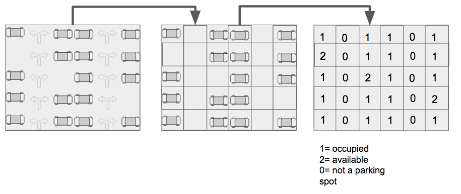

# `23` Parking lot

Podemos usar un arreglo bidimensional (matriz) para representar el estado actual de un estacionamiento así:



```js
parkingState = [
  [1,0,1,1,0,1],
  [2,0,1,1,0,1],
  [1,0,2,1,0,1],
  [1,0,1,1,0,1],
  [1,0,1,1,0,2],
  [1,0,1,1,0,1],
]
```

## 📝 Instrucciones:

1. Crea una función `getParkingLotState()` que devuelva un objeto con `totalSlots` (cantidad total de puestos), `availableSlots` (puestos disponibles) y `occupiedSlots` (puestos ocupados) de esta forma:

```js
const state = {
     totalSlots: 12,
     availableSlots: 3,
     occupiedSlots: 9
}
```

## 💡 Pista:

+ Tienes que hacer un bucle anidado.
